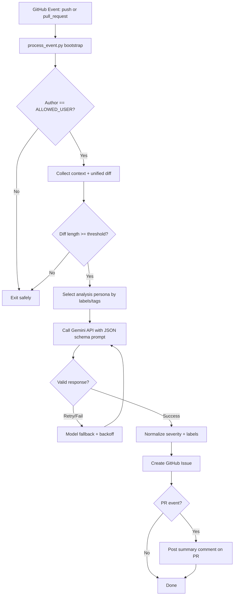

# Gemini Auto-Issue Generator

AI-powered GitHub Action that analyzes code changes and automatically opens structured, severity-tagged issues using Google Gemini.

[](https://github.com/OstinUA)
[](https://github.com/OstinUA)
[](LICENSE)
[](https://www.python.org/downloads/release/python-3110/)

> [!NOTE]
> This project operates as an IssueOps automation workflow: it processes GitHub events, sends contextual diffs to Gemini, then creates actionable GitHub Issues with labels and severity.

## Table of Contents
- [Title and Description](#gemini-auto-issue-generator)
- [Table of Contents](#table-of-contents)
- [Features](#features)
- [Tech Stack & Architecture](#tech-stack--architecture)
- [Getting Started](#getting-started)
- [Testing](#testing)
- [Deployment](#deployment)
- [Usage](#usage)
- [Configuration](#configuration)
- [License](#license)
- [Contacts & Community Support](#contacts--community-support)

## Features
- Automated diff extraction for both `push` and `pull_request` GitHub events.
- Persona-driven AI analysis through commit tags or PR labels (security, QA, performance, architecture, dependencies, release/product focus).
- Strict authorization gate via `ALLOWED_USER` to prevent unauthorized issue generation.
- Merge-commit skipping and empty/minimal diff protection to avoid noisy issues.
- Built-in severity normalization (`critical`, `high`, `medium`, `low`) with automatic severity labels.
- Structured issue output contract (problem statement, code reference, suggested fix).
- Optional PR summary comment linking back to the generated issue.
- Automatic permalinking to affected file and approximate line in GitHub source.
- Multi-model fallback strategy (`gemini-2.5-flash`, `gemini-2.0-flash`, `gemini-1.5-flash`).
- Exponential backoff and retry handling for API rate limits (`429`).
- Diff-size truncation safeguards for large payloads.
- Language enforcement in generated issue title/body/summary (English-only contract in prompt).

> [!TIP]
> You can steer the analysis role by adding tags in commit messages like `[sec]`, `[qa]`, `[perf]`, or by applying corresponding labels on a PR.

## Tech Stack & Architecture

### Core Stack
- **Language:** Python `3.11`
- **Runtime Environment:** GitHub-hosted runners (GitHub Actions)
- **Primary Dependencies:**
  - `PyGithub==2.6.1` for GitHub API operations.
  - `requests==2.32.3` for Gemini API calls.
- **LLM Backend:** Google Gemini API (`generateContent` endpoint, model fallback chain).

### Project Structure
```text
.
├── README.md
├── RU_README.md
├── process_event.py
├── requirements.txt
├── LICENSE
└── Documentation
    ├── label.md
    └── RU_label.md
```

### Key Design Decisions
- **Single-script execution model:** Event handling, prompt generation, model invocation, and issue creation are centralized in `process_event.py` for simple deployment and low operational overhead.
- **Prompt-contract enforcement:** The script requests strict JSON output and validates/consumes fixed keys to keep downstream issue creation deterministic.
- **Resilience-first API strategy:** Multiple Gemini models and retry/backoff logic reduce transient failure risk.
- **Security by ownership control:** The action executes only when the event author matches `ALLOWED_USER`.
- **Cost-aware architecture:** Uses Gemini Flash-family models to optimize for speed and lower token cost.

### Logging/Issue Pipeline (Mermaid)


> [!IMPORTANT]
> The script intentionally exits gracefully when model attempts are exhausted, preventing workflow hard-fail storms in CI.

## Getting Started

### Prerequisites
- Python `3.11` (or compatible 3.x where dependencies resolve).
- A GitHub repository with Actions enabled.
- A Google AI Studio API key for Gemini.
- GitHub repository secrets configured for runtime variables.

### Installation
1. Clone the repository:
   ```bash
   git clone https://github.com/<your-org>/<your-repo>.git
   cd <your-repo>
   ```
2. Create and activate a virtual environment:
   ```bash
   python -m venv .venv
   source .venv/bin/activate
   ```
3. Install dependencies:
   ```bash
   pip install -r requirements.txt
   ```
4. Add or verify your workflow file (for example: `.github/workflows/ai-issue.yml`) to execute `process_event.py` with required environment variables.

> [!WARNING]
> Ensure workflow permissions are set to allow issue creation (`Read and write permissions`) or issue creation will fail at runtime.

## Testing
Use the following commands to validate behavior before production rollout.

### Unit / Script Sanity Checks
```bash
python -m py_compile process_event.py
```

### Dependency & Environment Validation
```bash
python -m pip check
pip freeze | rg "PyGithub|requests"
```

### Integration Validation (GitHub Actions)
1. Create a branch:
   ```bash
   git checkout -b test/ai-issue-generator
   ```
2. Commit a controlled change with persona tag:
   ```bash
   git commit -am "test: validate security analyzer [sec]"
   git push origin test/ai-issue-generator
   ```
3. Open a PR and attach label(s) such as `qa`, `perf`, or `architecture`.
4. Confirm in Actions logs that:
   - author validation passes,
   - diff is extracted,
   - issue is created,
   - PR summary is posted (for PR events).

> [!CAUTION]
> This project does not currently include a dedicated automated unit test suite; runtime validation is primarily done via CI execution paths.

## Deployment

### Production Deployment via GitHub Actions
- Commit `process_event.py` and workflow configuration to the default branch.
- Configure required secrets and variables.
- Trigger via `push` or `pull_request` events.
- Monitor first executions in `Actions` and validate issue formatting consistency.

### CI/CD Integration Guidance
- Add branch filters (e.g., only `main`, `release/*`) to reduce analysis noise.
- Add path filters to skip docs-only changes if desired.
- Optionally add concurrency groups to avoid duplicate runs per branch/PR.

### Containerization (Optional)
If your organization runs self-hosted runners, containerize a compatible Python environment and mount required secrets as environment variables.

## Usage

### Basic Runtime Contract
`process_event.py` reads GitHub and Gemini configuration from environment variables and executes one event cycle.

```bash
export GITHUB_TOKEN="ghp_xxx"
export GEMINI_API_KEY="AIza..."
export REPOSITORY="owner/repo"
export EVENT_NAME="push"
export COMMIT_SHA="<commit_sha>"
export ALLOWED_USER="owner"
python process_event.py
```

### Persona-Driven Analysis by Commit Tag
```bash
# Security-focused analysis
git commit -m "feat(auth): add JWT validation [security]"

# QA-focused analysis
git commit -m "refactor(api): optimize pagination path [qa]"

# Performance-focused analysis
git commit -m "perf(cache): reduce redundant parsing [perf]"
```

### PR Label-Driven Analysis
Apply one of these labels to a PR before sync/update:
- `security`, `sec`, `audit`
- `review`, `refactor`, `code-review`
- `qa`, `test`, `testing`
- `perf`, `performance`, `optimize`
- `pm`, `release`, `product`
- `deps`, `dependencies`
- `arch`, `architecture`

## Configuration

### Required Environment Variables
- `GITHUB_TOKEN`: Token used by `PyGithub` for repository access and issue creation.
- `GEMINI_API_KEY`: Google Gemini API key.
- `REPOSITORY`: Repository slug in `owner/repo` format.
- `EVENT_NAME`: Supported values: `push`, `pull_request`.
- `ALLOWED_USER`: Case-insensitive GitHub login allowed to trigger analysis.

### Event-Specific Variables
- For `push` events:
  - `COMMIT_SHA`: Commit SHA to inspect.
- For `pull_request` events:
  - `PR_NUMBER`: Pull request number.

### Suggested `.env` Template (Local Dry-Run)
```dotenv
GITHUB_TOKEN=ghp_xxx
GEMINI_API_KEY=AIza...
REPOSITORY=owner/repo
EVENT_NAME=pull_request
PR_NUMBER=123
ALLOWED_USER=owner
```

### Operational Tuning Notes
- **Diff cap:** The script truncates very large diffs to control payload size.
- **Output cap:** Generated issue body is constrained before submission.
- **Retry policy:** Up to 4 attempts per model with increasing delays on `429`.
- **Fallback policy:** Automatically tries lower-tier models when primary fails.

## License
This repository is licensed under the **GNU Affero General Public License v3.0 (AGPL-3.0)**. See the `LICENSE` file for full terms.

## Contacts & Community Support

## Support the Project

[](https://www.patreon.com/OstinFCT)
[](https://ko-fi.com/fctostin)
[](https://boosty.to/ostinfct)
[](https://www.youtube.com/@FCT-Ostin)
[](https://t.me/FCTostin)

If you find this tool useful, consider leaving a star on GitHub or supporting the author directly.
